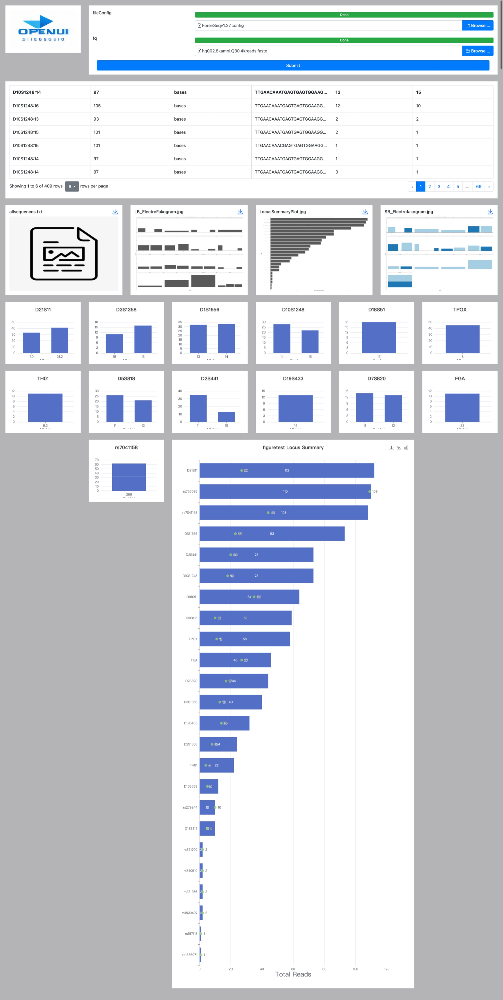

## openGUI

这是一个用来帮助脚本或者命令行工具快速构建B/S架构并生成对应图形化页面的工具。
* 无需写程序代码就可以让您的脚本或者命令行工具具有图形化的能力。
* 基于JSON格式的配置文件，根据例子可快速生成您的定制页面。
* 基于bootstrap的响应式布局，让您的页面灵活展示。
* 基于Echarts的图表显示，因此具有丰富的交互式图表体验。
* 目前页面可显示文件，图表，表格信息。
### environment
openJDK17、R(如有配置R语言脚本)、Python(如有配置Python脚本)
### example
代码库中的例子为STRaitRazor工具
https://github.com/Ahhgust/STRaitRazor

参考的页面为STRaitRazorOnline
https://github.com/ExpectationsManaged/STRaitRazorOnline

配置文件
```json
[
    {
        "order": 0,
        "input" : [
            {
                "name": "fileConfig",
                "type": "file",
                "param": "-c"
            },
            {
                "name": "fq",
                "type": "file",
                "param": ""
            }
        ]
    },
    {
        "order": 1,
        "execFile": "/Users/defuliu/workspace/IdeaProjects/openGUI/config/str8rzr_osX_M1",
        "input" : [
            {
                "name": "fileConfig",
                "type": "file",
                "param": "-c",
                "value": ""
            },
            {
                "name": "fq",
                "type": "file",
                "param": "",
                "value": ""
            },
            {
                "name": "allsequences.txt",
                "type": "path",
                "param":">",
                "value":"result/allsequences.txt"
            }

        ],
        "output": "result",
        "table": {
            "path": "result/allsequences.txt",
            "blockWeight": 12
        },
        "result": {
            "path": "result/allsequences.txt",
            "blockWeight": 3,
            "blockHeight": 3
        }
    },
    {
        "order": 2,
        "execFile": "Rscript /Users/defuliu/workspace/IdeaProjects/openGUI/config/1output_data.R",
        "input" : [
            {
                "name": "",
                "type": "path",
                "param":"",
                "value":"result/allsequences.txt"
            },
            {
                "name": "configone",
                "type": "path",
                "param": "",
                "value": "/Users/defuliu/workspace/IdeaProjects/openGUI/data/STRaitRazorAnalysisConfig.csv"
            },
            {
                "name": "configtwo",
                "type": "path",
                "param": "",
                "value": "/Users/defuliu/workspace/IdeaProjects/openGUI/data/HaplotypeDatabase.csv"
            }
        ],
        "output": ""
    },
    {
        "order": 3,
        "execFile": "Rscript /Users/defuliu/workspace/IdeaProjects/openGUI/config/2Figures.R",
        "input" : [
            {
                "name": "configone",
                "type": "path",
                "param": "",
                "value": "/Users/defuliu/workspace/IdeaProjects/openGUI/data/STRaitRazorAnalysisConfig.csv"
            },
            {
                "name": "",
                "type": "path",
                "param":"",
                "value":"OUTPUT_DATA/STRaitRazorIO.tsv"
            },
            {
                "name": "",
                "type": "path",
                "param": "",
                "value": "OUTPUT_DATA/AlleleSummary.tsv"
            },
            {
                "name": "",
                "type": "path",
                "param": "",
                "value": "OUTPUT_DATA/LocusSummary.tsv"
            }
        ],
        "output": "",
        "result": {
            "path": "allpic",
            "blockWeight": 3,
            "blockHeight": 3
        }
    },
    {
        "order": 4,
        "execFile": "Rscript /Users/defuliu/workspace/IdeaProjects/openGUI/config/2data_echarts.R",
        "input" : [
            {
                "name": "",
                "type": "path",
                "param":"",
                "value":"OUTPUT_DATA/STRaitRazorIO.tsv"
            },
            {
                "name": "",
                "type": "path",
                "param": "",
                "value": "OUTPUT_DATA/AlleleSummary.tsv"
            },
            {
                "name": "",
                "type": "path",
                "param": "",
                "value": "OUTPUT_DATA/LocusSummary.tsv"
            },
            {
                "name": "configone",
                "type": "path",
                "param": "",
                "value": "/Users/defuliu/workspace/IdeaProjects/openGUI/data/STRaitRazorAnalysisConfig.csv"
            },
            {
                "name": "chartjson",
                "type": "path",
                "param": "",
                "value": "/Users/defuliu/workspace/IdeaProjects/openGUI/data/3Electrofakogram.json"
            }
        ],
        "output": "",
        "charts": [
            {
                "file": "echarts/data_for_Electrofakogram",
                "blockWeight": 2,
                "blockHeight": 2
            },
            {
                "blockWeight": 6,
                "blockHeight": 20,
                "chart": {
                    "title": {
                        "text": "figuretest Locus Summary",
                        "left": "center"
                    },
                    "tooltip": {
                        "trigger": "axis",
                        "axisPointer": {
                            "type": "shadow"
                        }
                    },
                    "toolbox": {
                        "show": true,
                        "feature": {
                            "saveAsImage":{
                                "type": "png"
                            },
                            "magicType": {
                                "type": ["line", "bar"]
                            }
                        }
                    },
                    "xAxis": {
                        "type": "value",
                        "name": "Total Reads",
                        "nameLocation": "middle",
                        "nameGap": 20,
                        "nameTextStyle": {
                            "fontSize": 24
                        }
                    },
                    "yAxis": {
                        "type": "category",
                        "data": "${echarts/data_for_LocusSummary.txt#0}",
                        "axisLabel": {
                            "interval": 0
                        },
                        "name": "Locus",
                        "nameLocation": "center",
                        "nameRotate": 90,
                        "nameGap": 100,
                        "nameTextStyle": {
                            "fontSize": 24
                        }
                    },
                    "series": [
                        {
                            "name": "Total Reads",
                            "type": "bar",
                            "data": "${echarts/data_for_LocusSummary.txt#2}",
                            "label": {
                                "show": true,
                                "position": "inside"
                            }
                        },
                        {
                            "name": "Unique Haps",
                            "type": "scatter",
                            "yAxisIndex": 0,
                            "data": "${echarts/data_for_LocusSummary.txt#1}",
                            "symbolSize": 10,
                            "label": {
                                "show": true,
                                "position": "right"
                            }
                        }
                    ]
                }
            }
        ]
    }
]
```
效果图


### config
在config/config.json文件中，配置对应的脚本或者命令行工具
具体元素说明如下：

| 元素 | 说明 |
| ------- | ------- |
| order | 脚本的执行顺序，0表示第一个要执行的脚本，并且会在页面自动生成对应的输入框 |
| input | 表示脚本需要输入的参数，可以有一个或多个json对象 |
| execFile | 脚本的所在的决定路径 |
| output | 脚本的输出路径，如果此项不为空，则自动在用户空间创建路径 |
| table | 表示结果是一个表格，openGUI会自动根据表格数据的文件在页面生成对应的表格 |
| result | 表示结果是一个或多个文件或者图片，openGUI检测路径下是文件还是图片在页面上进行显示 |
| charts | 表示结果是一个或多个图标，用户可参考echarts的配置信息直接进行echarts图表展示 |

通用元素说明：

| 元素 | 说明 |
| ------- | ------- |
| blockWeight | 这个块所在页面的宽度，最大为12，一行由12个块组成 |
| blockHeight | 这个块所在页面的高度的比例，1：:400px |
| ${xxx} | 表示这个一个占位符一般用于echarts元素里面获取指定的文件中的数据 |


input中子元素说明如下：

| 元素 | 说明 |
| ------- | ------- |
| name | 输入的名称 |
| type | 输入的类型（支持文件和字符串） |
| param | 输入的参数 |

table中子元素说明如下：

| 元素 | 说明 |
| ------- | ------- |
| path | 表格数据的文件路径，相对路径表示脚本直接结果的路径 |

result中子元素的说明如下：

| 元素 | 说明 |
| ------- | ------- |
| path | 结果数据的文件或者文件夹路径 |

charts中支持三种配置模型，file模式、chart模式、xAxis+series模型 子元素的说明如下：

| 元素 | 说明 |
| ------- | ------- |
| file | echarts配置文件的路径 |
| chart | 直接用echarts配置的json |
| series | 对应echarts中的series |
| xAxis | 对应echarts中的xAxis |

### directory structure
* config：配置文件所在路径，一般将需要的脚本也放在这个目录方便管理
* data：基础数据所在路径，包括logo的图表和需要固定的一些数据。
* userspace：（自动创建）用户空间所在路径，用户每次提交都会创建一个当前线程的工作路径
* temp：（自动创建）页面缓存路径，某些临时的文件，可定期清理
* update：（自动创建）用户上传文件的路径

### build
1. 将命令行工具或脚本按照规则配置到config.json中。
2. 使用maven构建jar包，并放在顶层工作目录下
3. 运行jar，或者直接运行打包后的脚本
```java
 java -jar openGUI-v1.0.jar
```

